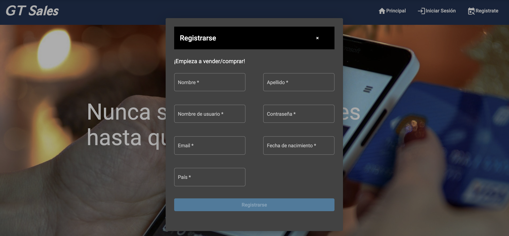
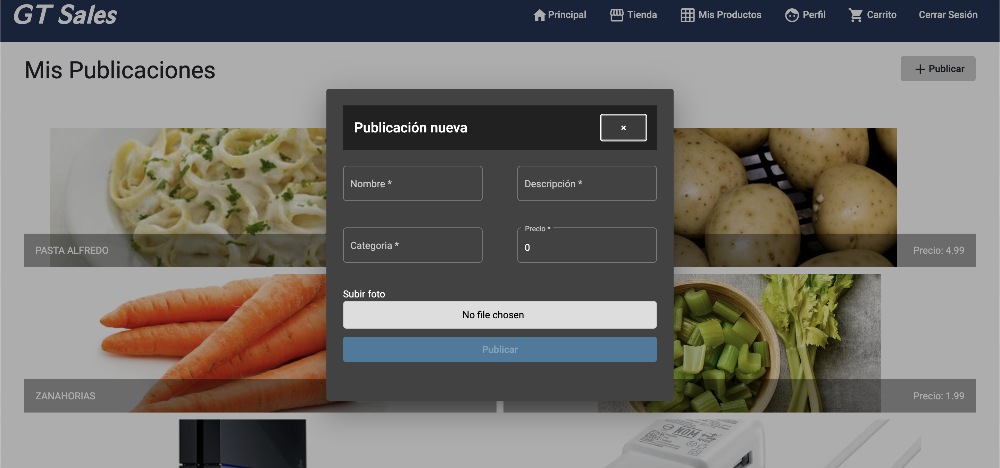
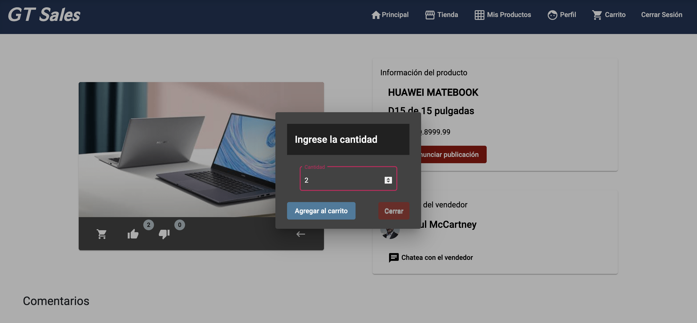
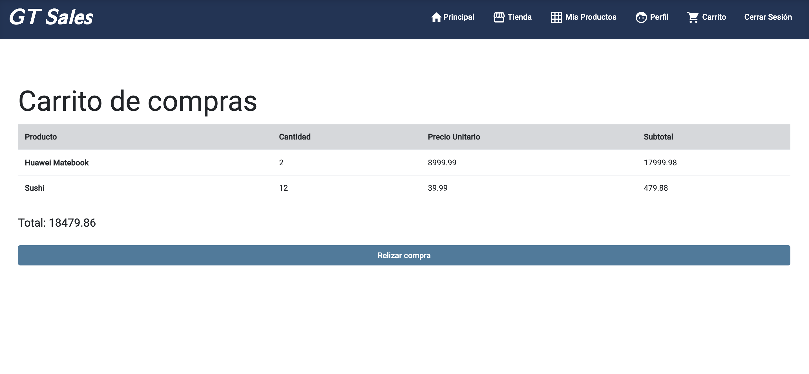
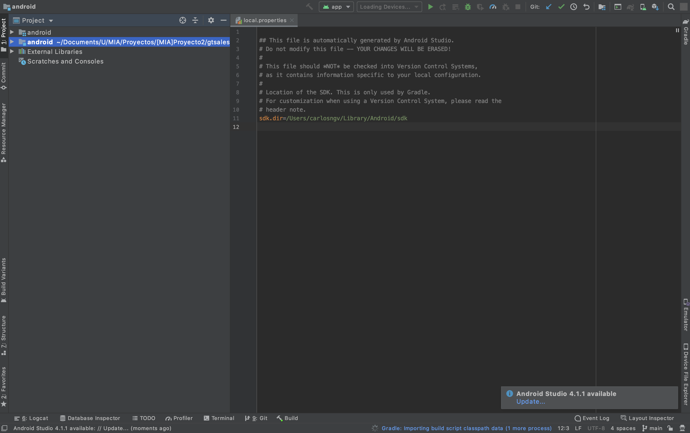
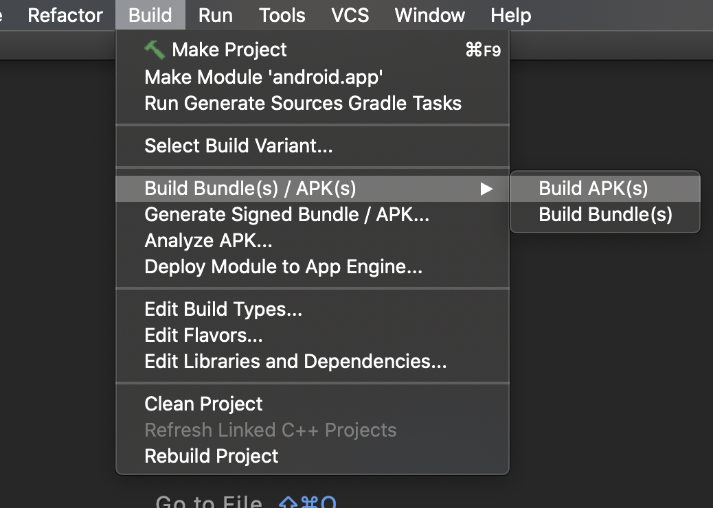

# GT Sales

### Manual Técnico

---

GT Sales es una plataforma de compra/venta, en donde personas de distintos paise pueden ingresar sus productos a la venta, así como comprar productos de distintos usuarios.

La aplicación web es intuitiva y fácil de usar. No se necesita ser un experto en el tema para poder hacer uso de esto.

GT Sales se adapta a los dispositivos móviles, de hecho, una versión para dispositivos Android está disponible para su uso.


## Base de datos
---
Se utilizó la base de datos de Oracle en su versión 11g. La instalación de este mismo se realizo en un contenedor, con docker. Ya que es una instalación relativamente sencilla y mucho más rápida que realizarlo de manera física.


## Vista de la aplicación

---

Para llevar a cabo la aplicación se utilizó Angular en su versión más reciente. La instalación es demasiada sencilla, muy accesible en su página oficial.

Para la creación de la interfaz se optó por utilizar Anguar Material y FxFlex. El primero para el uso de componentes y funciones que ayudan a la creación de la interfaz gráfica y el segundo para instalar las directivas dentro de la aplicación que permiten acomodar de manera efizac el contenido de las plantillas.

```bash
    ng add @angular/material
    npm install @angular/flex-layout --save
```

Cabe mencionar que FxFlex facilita un poco el diseño responsivo, ya que dependiendo del tamaño del dispositivo, existe una directiva que se activa cuando el tamaño cambia.

Así es cómo quedó la página, un diseño un poco complejo y llamativo para el usuario. Intuitivo a su vez.


## Inicio de Sesión y Registro

---

Para el inicio de sesión, al usuario, se le presenta un formulario que debe de llenar:



Al momento de registrarse, le llegaré un correo al usuario y deberá de verificar su cuenta. De lo contrario, no será posible loguearse hacia la página. 

El login es demasiado sencillo. Basicamente se crea un objeto en el *localstorage* con toda la información del usuario logueado. Esto permite obtener con mayor facilidad los datos mediante la API.

## Realizar Publicación

Los usuarios son capaces de crear publicaciones, ingresando el producto que desean vender junto con información. Se hace llenando el siguiente formulario:



Al momento de crear la publicación, se crea un detalle de publicación. Este último contiene la cantidad de likes y dislikes, asi como los comentarios que irá recibiendo.

## Chat entre usuarios
---

Para realizar el chat entre usaurios se hizo uso de una librería de *javascript* llamada *socket.io*. Brinda la facilidad de comunciación entre cliente-servidor en tiempo real. Se basa en una transferencia de datos bidireccional, donde los datos pueden tomar cualquier forma, en este caso en formato JSON.

Para instalarlo se requirió del siguiente comando a ejecutar dentro del servidor y el cliente, respectivamente.

``` bash
    npm install socket.io
    npm install socket.io-client
```

El segundo comando debe de ser instalado dentro de nuestro proyecto en Angular. Permitiendo así la conexión dentor del socket.

Dentro del proyecto Angular, se requiere configurar el socket dentro del servicio que vamos a utilizar, en esta ocasión, el servicio de chat que genero:

```typescript
    export class ChatService {
        // Connect to server socker.
        private socket:any; 

        constructor(
            private http: HttpClient,
            private processHttpMsgService: ProcessHttpMsgService
        ) { 
            this.socket = io(baseURL);
        }
    }
```

Asímismo, debe configurarse del lado del servidor.

```JavaScript
    const app = require("express")();
    const serverHTTP = require('http').Server(app);
    const io = require('socket.io')(serverHTTP);

    ...

    io.on('connection', (socket) => {
        console.log('User connected', socket.id);
        socket.on('newMessage', async (data) => {
            socket.emit('newMessage', data);
            let chat_message = data.chat_message;
            let client_id = data.client_id;
            let chat_room_id  = data.chat_room_id;
            let query = `
                insert into message (message_content, client_id, chat_room_id) values
                (:chat_message, :client_id, :chat_room_id )
            `;
            await db.Open(query, [chat_message, client_id, chat_room_id], true).then(
                (res) => {
                console.log(res);
                },
                (err) => {
                console.log(err);
                }
            );
            socket.broadcast.emit('newMessage', data);
        });
    });
```

Como puede observarse, socket.io tiene funciones built-in, como se puede apreciar, *on* y *emit*. La función emit, como su nombre lo indica, emite lo que se le especifica a los usuarios que se encuentren conectados al socket. Con *on* se especifica el evento a realizar y cómo manejarlo. 

Para está aplicación, el evento utilizado tiene el nombre de *newMessage* dentro de este mismo, se realiza la instrucción *sql* que agrega el mensaje a la base de datos. A su vez, el mensaje se emite a los usuarios conectas y puede ser visto desde ambos usuarios en tiempo real, así es como funciona socket.io.

El chat se ve de la siguiente forma:


## Compra de producto

---

Los usaurios pueden comprar los distintos productos que se le muestra por parte de los demás usuarios. Tienen la opción de elegir cuantos de este producto comprar.



Los productos que se van seleccionando se irán almacenando dentro del carrito de compras, que los lista y muestra el total de la orden y el subtotal por producto.





Al momento de realizar la compra, se realizará la transacción de creditos y al usuario se le notificará via mail adjuntandole una factura con el detalle de su orden.

La ruta en el servidor utilizada para llevar a cabo está acción es la siguiente:

```javascript
    const shoppingCartRouter = require('express').Router();
    const db = require("../config/db");

    shoppingCartRouter.post('/purchaseProduct', async (req, res) => {
        const { purchase_id, product_id, product_qty } = req.body;
        console.log(req.body)
        let newPurchaseDetail = `  
            insert into purchase_detail (product_id, purchase_id, product_qty, subtotal)  
            (select :product_id, :purchase_id, :product_qty, product_unit_price * :product_qty as subtotal 
            from product where product_id = :product_id)
        `
        await db.Open(newPurchaseDetail, [product_id, purchase_id,product_qty], true)
            .then(res => console.log(res), err => console.log(err));

        let updateProductPurchases = ` 
        update product set purchases = (purchases + 1) where product_id = :product_id
        `

        await db.Open(updateProductPurchases, [product_id], true)
            .then(res => console.log(res), err => console.log(err));

        res.json({
            message: 'Successfully purchsed!'
        });
});
```

## Generación de la APK

---

Gracias al diseño responsivo de la aplicación, generar el APK y probarlo se facilitó en cierto modo. Es decir, no hubo ninguna deformación al momento de probarlo en un dispositivo móvil.

Para ello se utilizó *Capacitor*, que permite preparar la aplicación para android o ios.

Para empezar a preparar el proyecto se siguen los siguientes comandos dentro del proyecto de Angular:

```bash
    ng add @capacitor/angular
    ...
    ng build --prod
    ...
    npx cap add android
    npx cap add ios 
```

Una vez preparado el proyecto se ejecuta el siguiente comando que abre Android Studia y prepara el proyecto:

```bash
    npx cap open
```

Se abrirá en seguida Android Studia y se verá lo siguiente:



Si no hay ningún problema, este es el resultado. El proyecto ya montado listo para ser compilado y generar el .apk. Se accede al submenu build y luego a *Buld Bundle(s) / APK(s)* donde seleccionaremos Build APK(s).




Y listo se generará la apk en una carpeta dentro del proyecto. Android Studio brindará al usuario la dirección de está carpeta.


Para probar la APK, se utilizó el simulador de Android llamado *bluestacks*. Simplemente se da doble click sobre el .apk generado y se instala automáticamente en el simulador.

Para permitir la conexión en distintos dispositivos hacia la API, se utilizó *ngrok*. Es una herramienta para convertir el servidor local en un servidor accesible mediante una IP generada aleatoriamente así poder visualizarlo desde cualquier dispositivo, incluso desde cualquier parte del mundo. Esto resolvió el probleme de conexión que se presenta al querer hacer uso dentro del simulador de Android.

Instalación de Ngrok en MacOS:
```bash
    brew cask install ngrok
```
Gracias a esta herramienta se logró la completa funcionalidad de la aplicación dentro de un dispositivo Android. A continuación, una imagen de la simulación dentro de Android Studio:


