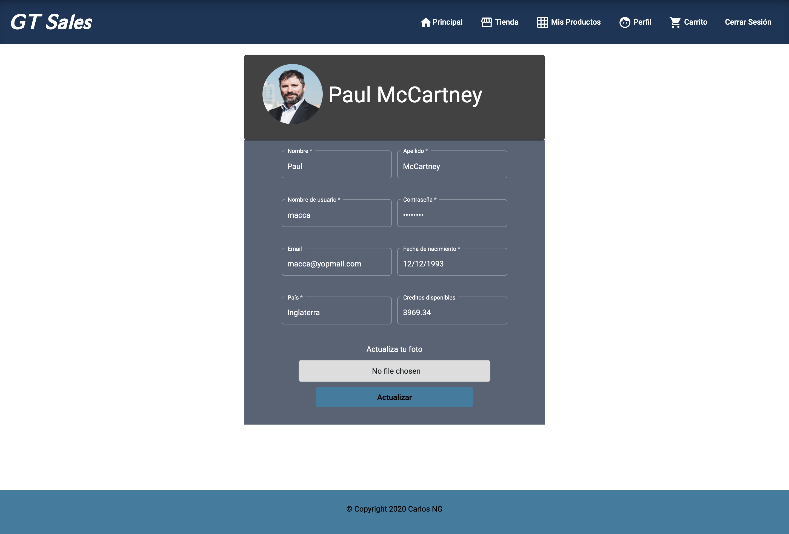
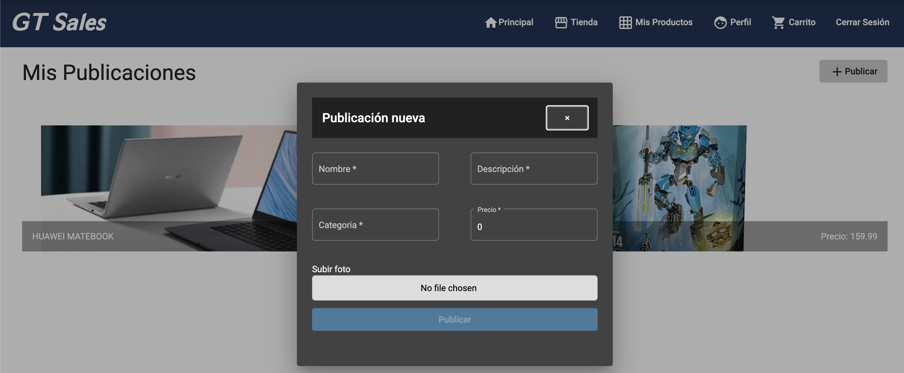
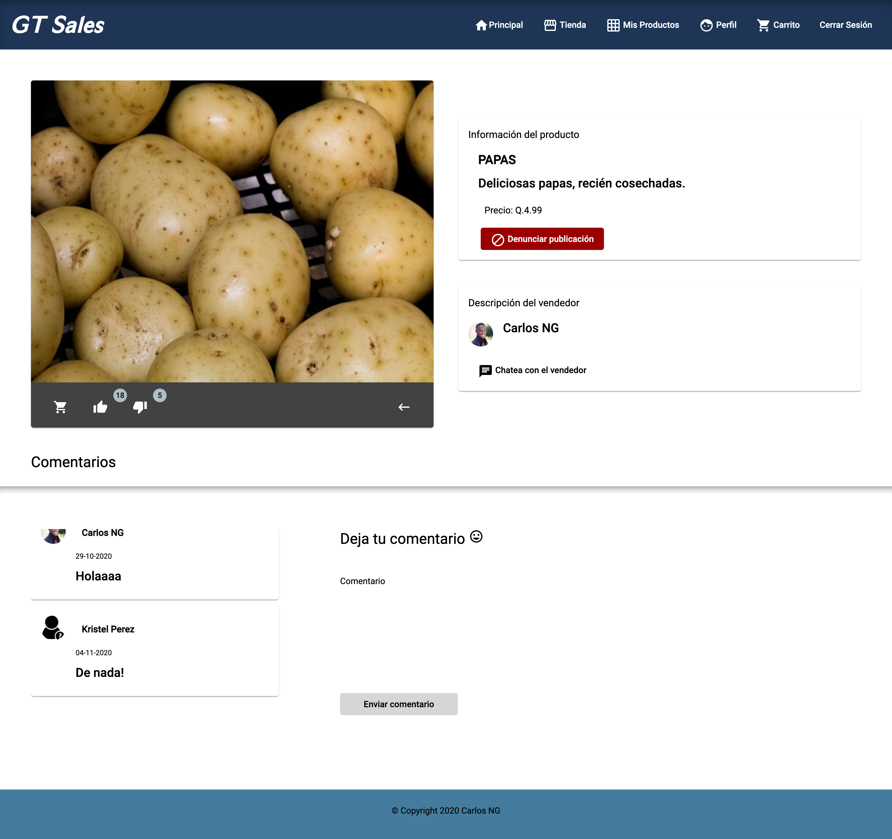
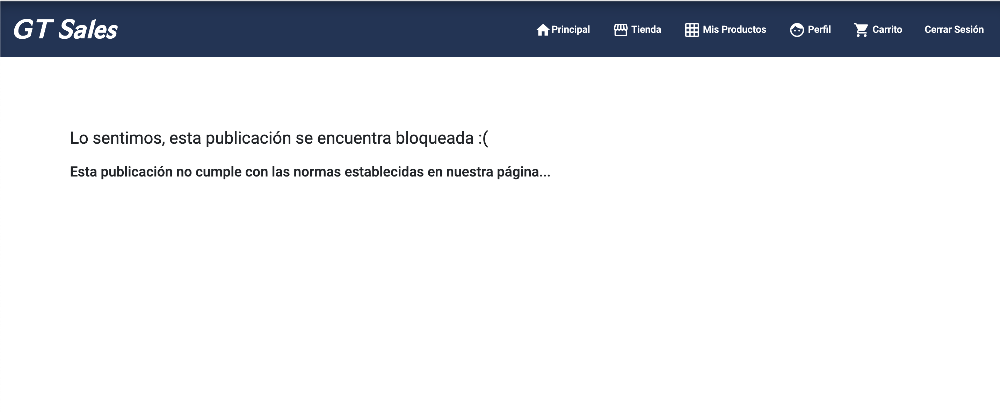
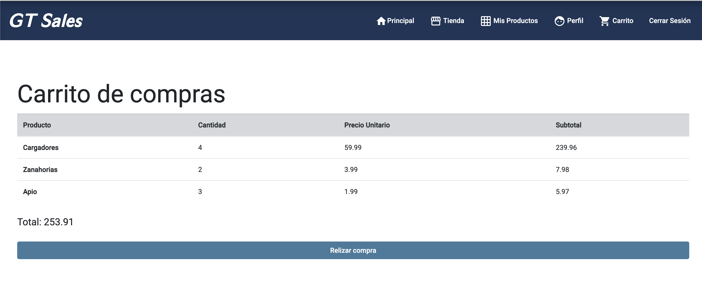

# GT Sales
--- 

GT Sales es una plataforma de compra/venta, en donde personas de distintos paise pueden ingresar sus productos a la venta, así como comprar productos de distintos usuarios.

La aplicación web es intuitiva y fácil de usar. No se necesita ser un experto en el tema para poder hacer uso de esto.

GT Sales se adapta a los dispositivos móviles, de hecho, una versión para dispositivos Android está disponible para su uso!

### Vista de la aplicación

--- 

La página principal (o home) de la app, consta de un diseño relativamente sencillo, en donde a simple vista se puede ver el menu en la parte superior. Las opciones estarán disponibles dependiendo del estado del usuario. Logueado o no.

En donde el usuario podrá navegar a través de distintas secciones: la tienda, la sección de mis productos, perfil y el carrito de compras.

Al momento de registrar, el usuario recibirá un correo de confirmación. Tendrá que validarlo, si no, no tendrá a acceso a la página. El correo no tiene expiración y se valida simplemente con un click al botón que contiene la información.

Dentro del perfil del usuario, es posible actualizar la información, a excepción del correo eléctronico y los creditos disponibles, por obvias razones.

La sección de tienda, contiene todos los productos ajenos al usuario logueado. Podrá entrar a cada publicación, y si lo desea, agregar el producto al carrito.

### Publicaciones

---

Todo usuario es capaz de realizar nuevas publicaciones, ingresar sus productos, detallando su precio, descripción, nombre y demás información como se muestra a continuación

La publicación en sí contiene toda la información del producto y de quién lo vende. Asimismo, el usuario podrá dejar un comentario, darle me gusta o no me gusta a la publicación, chatear con el vendedor y si es necesario, denunciar la publicación.

### Chat

El chat con el vendedor es en tiempo real, es decir, reacción instantánea. Esto es una herramienta muy útil dentro de la página, ya que a veces se necesita más información de lo brindado en la descripción del producto, o por temas de seguridad y llegar a querer a conocer más acerca de quién venda tal producto.

### Denuncias
 Las denuncias son tomadas muy en cuenta dentro de la empresa, es por eso, que los administradores del la aplicación se toman el tiempo necesario de analizarlas y de ser necesario bloquear las publicaciones. Dependiendo de la situación.

Una publicación denunciada y bloqueada por el encargado:

 

### Sección de comentarios

Cualquier usuario que visite la publicación podrá n comentarios, ya sea positivos o negativos. Una vez comentado, se verá reflejado con su nombre y foto de perfil dentro del contenedor de comentarios.

### Likes y dislikes

Todos los usuarios son libres de opinar, podrán dejar su like o dislike, dependiendo si les gustó el producto o no. Queda a discresión de cada quién, pero para ser más especificos al momento de no gustarle el producto, siempre está la opción de denunciar.

## Carrito de Compra

Al momento de que el usuario ingresa a la publicación, puede realizar una compra, dando click en el botón del carrito de compras de lado de los likes y dislikes. Tendrá la opción de elegir la cantidad del producto a comprar.

 

Se detalla el nombre del producto, cantidad, su precio unitario y resultado del subtotal por producto. Al final de la lista de productos se observa el total de la orden. Al momento de realizar la compra se le sustraen los creditos al usuario y se le envia un correo con la factura de la orden, especificando los productos y el precio.

